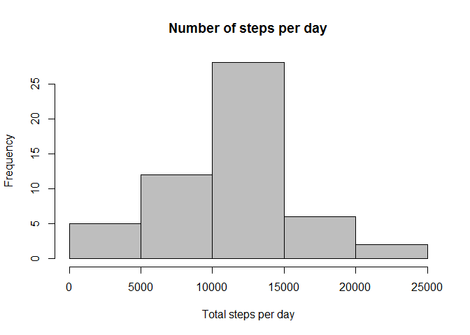
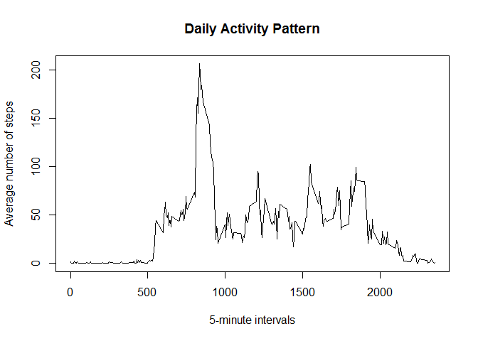
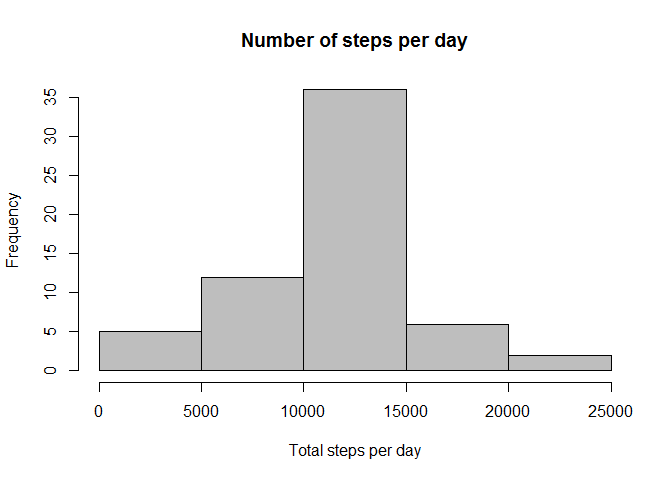
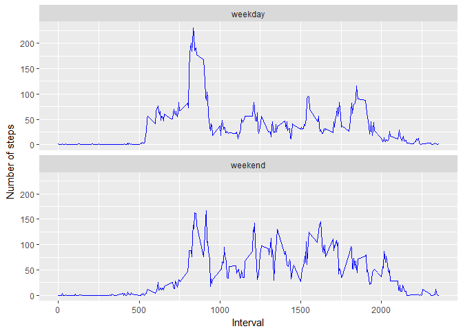

# Reproducible Research: Peer Assessment 1

First, the necessary libraries are loaded, and file names defined as constants.

```r
# Load libraries
library(dplyr)
```

```
## 
## Attaching package: 'dplyr'
```

```
## The following objects are masked from 'package:stats':
## 
##     filter, lag
```

```
## The following objects are masked from 'package:base':
## 
##     intersect, setdiff, setequal, union
```

```r
library(ggplot2)
library(knitr)

# Constants
zipFileName = "activity.zip"
datFileName = "Activity.csv"
datFileUrl = "https://d396qusza40orc.cloudfront.net/repdata%2Fdata%2Factivity.zip"
```

## Loading and preprocessing the data

Show any code that is needed to

1. Load the data (i.e. `read.csv()`)

2. Process/transform the data (if necessary) into a format suitable for your analysis


```r
# Check if the data file exists
if(!file.exists(datFileName)){
    if(!file.exists(zipFileName)){
        download.file(datFileUrl,zipfileName)
    }
    unzip(zipFileName)
}
# Load data
datRaw <- read.csv(datFileName, na.strings="NA")
```

## What is mean total number of steps taken per day?

For this part of the assignment, you can ignore the missing values in
the dataset.

1. Make a histogram of the total number of steps taken each day

2. Calculate and report the **mean** and **median** total number of steps taken per day


```r
# remove NA in data
dat <- datRaw[complete.cases(datRaw),]
# group by day, then caluclate the total daily steps
dat <- group_by(dat, date)
stepsPerDay <- summarize(dat, dailySteps=sum(steps))
# draw histogram, print mean and median
hist(stepsPerDay$dailySteps, main="Number of steps per day", 
     xlab="Total steps per day", col="gray")
```

<!-- -->

```r
print(paste("Mean:", round(mean(stepsPerDay$dailySteps),2), 
            " Median:",median(stepsPerDay$dailySteps) ))
```

```
## [1] "Mean: 10766.19  Median: 10765"
```

## What is the average daily activity pattern?

1. Make a time series plot (i.e. `type = "l"`) of the 5-minute interval (x-axis) and the average number of steps taken, averaged across all days (y-axis)

2. Which 5-minute interval, on average across all the days in the dataset, contains the maximum number of steps?


```r
# aggregate steps by interval and plot the diagram
stepsByInterval <- aggregate(steps ~ interval, dat, mean)
plot(stepsByInterval$interval, stepsByInterval$steps, type='l', 
     main="Daily Activity Pattern", xlab="5-minute intervals", 
     ylab="Average number of steps")
```

<!-- -->

```r
# which row has the max number of steps?
maxRow <- which.max(stepsByInterval$steps)
print(paste("The maximum number of steps:", round(stepsByInterval[maxRow, ]$steps,2),
            "at interval:", stepsByInterval[maxRow, ]$interval))
```

```
## [1] "The maximum number of steps: 206.17 at interval: 835"
```

## Imputing missing values

Note that there are a number of days/intervals where there are missing values (coded as `NA`). The presence of missing days may introduce bias into some calculations or summaries of the data.

1. Calculate and report the total number of missing values in the dataset (i.e. the total number of rows with `NA`s)

2. Devise a strategy for filling in all of the missing values in the dataset. The strategy does not need to be sophisticated. For example, you could use the mean/median for that day, or the mean for that 5-minute interval, etc.

3. Create a new dataset that is equal to the original dataset but with the missing data filled in.

4. Make a histogram of the total number of steps taken each day and Calculate and report the **mean** and **median** total number of steps taken per day. Do these values differ from the estimates from the first part of the assignment? What is the impact of imputing missing data on the estimates of the total daily number of steps?


```r
# Calculate the total number of missing values
print(paste("Total number of missing values:", sum(is.na(datRaw))))
```

```
## [1] "Total number of missing values: 2304"
```

```r
# created new, separate data set for imputed data
datImputed <- datRaw
# for missing step values, impute the previously caluclated mean
for (i in 1:nrow(datImputed)) {
    if (is.na(datImputed$steps[i])) {
        datImputed$steps[i] <-
            stepsByInterval[stepsByInterval$interval==datImputed$interval[i],]$steps
    }
}
# summarize steps by date, prepare histogram data
dat <- group_by(datImputed, date)
stepsPerDay <- summarize(dat, dailySteps=sum(steps))
# draw histogram, print mean and median
hist(stepsPerDay$dailySteps, main="Number of steps per day", 
     xlab="Total steps per day", col="gray")
```

<!-- -->

```r
print(paste("Imputed data, Mean:", round(mean(stepsPerDay$dailySteps),2), 
            " Median:",round(median(stepsPerDay$dailySteps),2)))
```

```
## [1] "Imputed data, Mean: 10766.19  Median: 10766.19"
```

Compared to the first patr of the assignment, the mean stayed the same, but the median increased to be almost equal to the mean. The reason for this is the method I chose, filling in the missing values with the means.

## Are there differences in activity patterns between weekdays and weekends?

For this part the `weekdays()` function may be of some help here. Use
the dataset with the filled-in missing values for this part.

1. Create a new factor variable in the dataset with two levels -- "weekday" and "weekend" indicating whether a given date is a weekday or weekend day.

2. Make a panel plot containing a time series plot (i.e. `type = "l"`) of the 5-minute interval (x-axis) and the average number of steps taken, averaged across all weekday days or weekend days (y-axis).


```r
# add a weekend factor with weekday and weekend values, depnding on wheterh
# weekdays() show Saturday or Sunday for the given date
weekendDays <- c("Saturday","Sunday")
dat$date <- as.Date(dat$date)
dat$weekend <- factor((weekdays(dat$date) %in% weekendDays),
                      levels=c(FALSE, TRUE),labels=c("weekday", "weekend"))
# aggregate using the intervals and the weekend factor
dat <- aggregate(steps ~ interval + weekend, dat, mean)
# draw the plot
qplot(interval, steps, data=dat, geom="line", color=I("blue"),
    xlab = "Interval", ylab = "Number of steps")+facet_wrap(~ dat$weekend, ncol = 1)
```

<!-- -->

Conclusion: There are some differences between the weekdays and the weekend. On weekdays, the subject wakes up and starts to walk earlier. After an active period in the morning, his / her activity declines. On weekends, the acvitiy level stays higher during the day.
